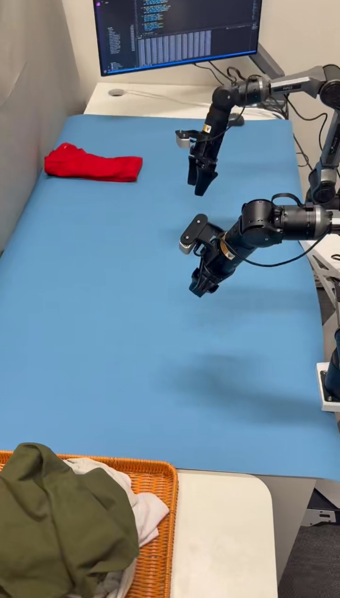
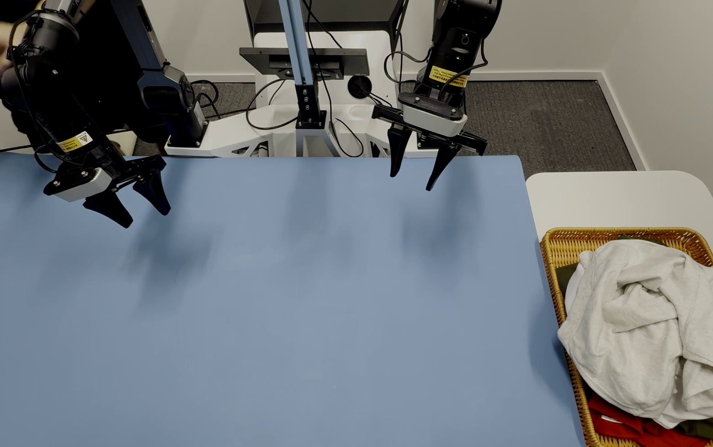

# 衣物折叠任务套件

> RTC Anything 的机器人衣物折叠任务指南。平台架构、运行时配置和部署命令请参考[主 README](../README_zh.md)。

---

## 📋 目录

- [效果演示](#-效果演示)
- [场景搭建](#-场景搭建)
- [数据采集](#-数据采集)
- [折叠策略](#-折叠策略)
- [常见问题排查](#-常见问题排查)

---

## 📺 效果演示

<table align="center">
  <thead>
    <tr>
      <th align="center">侧视视角</th>
      <th align="center">俯视视角</th>
    </tr>
  </thead>
  <tbody>
    <tr>
      <td align="center" width="360">
        <video src="https://github.com/PEILAB-PhysAI/RTC-Anything/releases/download/deploy_demo_videos/cloth_folding_side_view.mp4" controls width="360"></video>
      </td>
      <td align="center" width="360">
        <video src="https://github.com/PEILAB-PhysAI/RTC-Anything/releases/download/deploy_demo_videos/cloth_folding_top_view.mp4" controls width="360"></video>
      </td>
    </tr>
  </tbody>
</table>

## 🎬 场景搭建

### 三相机布局方案

- **高位俯视视角（相机 0）**：高度约为机械臂关节 j2 竖直后，j3 关节高度的两倍。
- **左侧腕部视角（相机 1）+ 右侧腕部视角（相机 2）**

### 关键环境控制要点

#### 🔒 遮挡管理

- 使用屏风或幕布遮挡无关背景区域。
- 确保相机只捕获有效操作区域。
- 尽量减少动态干扰，例如人员走动或物体移动。

#### 💡 光照优化

- 使用漫反射、均匀光照；光照不均时可使用遮光帘或柔光材料进行均匀化。
- 避免直射光和强方向性阴影；通过实时相机画面检查是否有眩光或暗区。
- 根据衣物和桌面颜色手动调节曝光和对比度，具体可参考“数据采集”部分的相机参数设置。

#### 🪑 工作台设计

- 表面颜色：浅灰色或米色，避免纯白色导致过曝。
- 材质：哑光表面，减少镜面反射。
- 对比度：确保衣物颜色与桌面背景有明显区分。

### 📸 真实场景展示

以下是我们的实际工作空间，包括侧视和俯视视角：

  
  

---

## 📊 数据采集

### 基于 ROS 的采集流程

#### 1. Topic 配置与时间同步

- **采集帧率**：设置合适的采样频率，推荐 **30Hz**，用于平衡数据量和计算开销。
- **数据结构**：原始数据保存为 **HDF5 格式**，采集后可转换为 **LeRobot 0.3.4 格式**。

#### 2. 相机参数调节

- **必须关闭自动曝光和自动曝光优先级**。
- 原因：折叠过程中衣物与相机的距离会快速变化，自动曝光会导致画面亮度突变，进而造成训练 loss spike 和策略收敛失败。
- 根据光照条件、衣物颜色和桌面颜色手动调节曝光与对比度。
- 浅色衣物容易反光，需要较低曝光；深色衣物容易过暗，需要适当提高曝光。

#### 3. 数据格式与转换

- 采集流程：ROS bags（原始数据）→ HDF5（含元数据的中间格式）→ LeRobot v0.3.4 格式（可用于训练）。

#### 4. 采集规范

##### 🎯 抓取一致性

- **正确方式**：夹爪下降到轻触桌面后再闭合抓取。
- **错误方式**：直接在空中抓取。
- 原因：仅凭 RGB 图像，模型很难区分“接近桌面”和“悬空”状态。不一致的抓取高度会导致推理时夹爪下降不足，最终抓取失败。

##### 🔄 策略标准化流程

- 每次采集遵循固定三阶段流程：抓取 → 展平 → 折叠。
- 展平阶段需要保证策略一致性：夹爪抓取位置（例如最低左右点，或左上/右下角）、抛甩方向、释放高度和终止条件（例如两个底角同时可见）都应统一。

---

## 🧠 折叠策略

### 目标特征点选择

- **底角**
- **肩角**
- **袖口**

### 展平阶段策略

- 在目标特征点完全暴露前，夹爪始终抓取固定的相对位置，例如最低左右点、左上角和右下角。
- 执行抓取 → 抛甩 → 释放循环，直到双臂所需目标特征点同时可见。
- 抛甩方向、幅度和释放高度应保持一致，以降低策略随机性。

### 折叠阶段策略

- 根据衣物类型（T 恤、衬衫、裤子等）和材质（硬挺程度、光滑程度）动态选择策略，例如：

| 策略类型 | 操作流程 | 适用场景 |
|----------|----------|----------|
| 横向 + 纵向折叠 | 抓取同侧肩角和底角 → 横向折叠 → 纵向折叠 | T 恤、衬衫 |
| 先折袖子 | 先折袖子 → 纵向折叠 → 最后横向折叠 | 长袖衣物 |

### 自适应策略选择

不同衣物类型和材质需要设计不同的折叠策略：

- **硬挺衣物**：更容易抓取，通常需要更少展平动作，也更容易保持形状。
- **柔软或光滑衣物**：需要更多抛甩才能展平；夹爪抓取时要注意防滑，抛甩等动作速度应适当降低，避免衣物滑落。

---

## 🔍 常见问题排查

| 现象 | 可能原因 | 解决方案 |
|------|----------|----------|
| 训练 loss spike | 采集时开启了自动曝光 | 关闭自动曝光并重新采集数据 |
| 部署时抓取失败 | 训练数据中的抓取高度不一致 | 采集时强制执行“先轻触桌面再抓取”规则 |
| 机械臂动作抖动 | 推理帧率与控制循环频率不匹配 | 对齐循环频率并启用 real-time chunking |
| 特征点检测失败 | 光照不足或对比度过低 | 手动调节曝光并优化工作空间光照 |
| 抛甩时衣物滑落 | 速度过高或夹持力不足 | 降低动作速度，或增加橡胶夹爪垫 |
