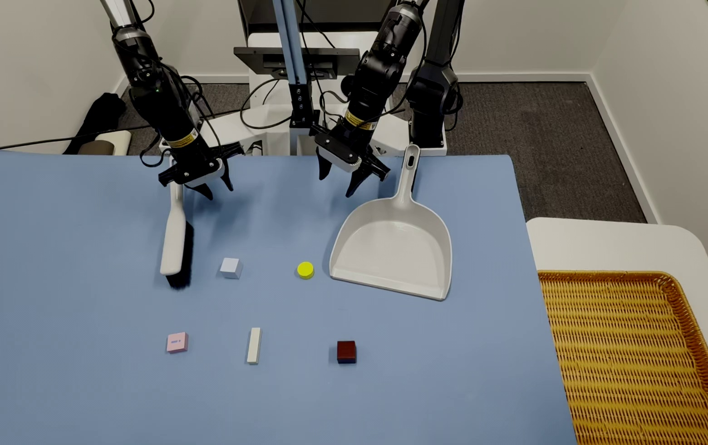

<div align="center">

[](https://huggingface.co/datasets/PEILAB-PhysAI/RTC-Anything)
[](object_sweeping.md)
[](object_sweeping_zh.md)

</div>

# Object Sweeping Task Suite

> Task-specific guide for robotic object sweeping with RTC Anything. For platform architecture, runtime configuration, and deployment commands, see the [main README](../README.md).

---

## 📋 Table of Contents

- [Demonstration](#-demonstration)
- [π0 Training Setup](#-π0-training-setup)
- [Scene Setup](#-scene-setup)
- [Data Collection](#-data-collection)
- [Sweeping Strategy](#-sweeping-strategy)
- [Troubleshooting](#-troubleshooting)

---

## 📺 Demonstration

<table align="center">
  <tr>
    <td align="center" width="360">
      <video src="https://github.com/user-attachments/assets/cc3c1982-cf7f-499e-a01f-fbe8d6db2f00" controls width="360"></video>
    </td>
  </tr>
</table>

## 🤖 π0 Training Setup

We trained the π0 policy for **50,000** steps with the configuration below.

```python
TrainConfig(
    name="pi0_base_aloha_folding_full",
    model=pi0_config.Pi0Config(),
    data=LeRobotAlohaDataConfig(
      repo_id="object_sweeping",  # your datasets repo_id
      adapt_to_pi=False,
      repack_transforms=_transforms.Group(inputs=[
        _transforms.RepackTransform({
          "images": {
            "cam_high": "observation.images.cam_high",
            "cam_left_wrist": "observation.images.cam_left_wrist",
            "cam_right_wrist": "observation.images.cam_right_wrist",
          },
          "state": "observation.state",
          "actions": "action",
          "prompt": "prompt",
        })
      ]),
      base_config=DataConfig(
        #local_files_only=True,  # Set to True for local-only datasets.
        prompt_from_task=True,  # Set to True for prompt by task_name
      )
    ),
    optimizer=_optimizer.AdamW(clip_gradient_norm=1.0),
    batch_size=32,  # the total batch_size not pre_gpu batch_size
    weight_loader=weight_loaders.CheckpointWeightLoader("gs://openpi-assets/checkpoints/pi0_base/params"),
    num_train_steps=50000,
    log_interval=1,
    fsdp_devices=2,
  )
```

For other task datasets, swap `repo_id` to the corresponding dataset.

---

## 🎬 Scene Setup

The scene setup, camera layout, lighting control, and workspace table requirements are consistent with the [Clothes Folding Task Suite](clothes_folding.md), so they are not repeated here.

### 📸 Real Scene Demonstration

Here is the overhead view of the actual workspace for the object sweeping task:

<div align="center">
  
</div>

---

## 📊 Data Collection

The data collection pipeline, ROS topic configuration, time synchronization, camera parameter tuning, data format conversion, and collection practices are consistent with the [Clothes Folding Task Suite](clothes_folding.md).

During collection, each trajectory should follow a consistent task order and action boundary to avoid policy learning difficulties caused by inconsistent object order, tool initial poses, or tool placement.

---

## 🧠 Sweeping Strategy

### Task Objective

The robot first grasps the dustpan and brush, sweeps 5 objects on the table into the dustpan in a fixed order, pours the objects from the dustpan into the basket on the left, and finally returns the dustpan and brush to their original positions.

### Standard Operation Flow

1. The two robotic arms grasp the dustpan and brush respectively.
2. Sweep the 5 objects on the table in a predefined order.
3. Sweep each object into the dustpan and ensure it stably enters the dustpan area.
4. Move the dustpan containing the objects above the basket on the left.
5. Rotate or tilt the dustpan to pour the objects into the basket.
6. Return the dustpan and brush to their initial positions.
7. Move both arms back to the ending pose to complete the task.

### Collection Consistency Guidelines

- **Fixed sweeping order**: The sweeping order of the 5 objects should remain consistent across all demonstrations.
- **Consistent tool poses**: The grasping positions, gripper closing timing, and lifting heights for the dustpan and brush should remain stable.
- **Consistent sweep-in criterion**: Each object should fully enter the dustpan before the next sweeping action starts.
- **Consistent pouring action**: Move the dustpan above the basket before pouring to avoid objects sliding out during transfer.

---

## 🔍 Troubleshooting

| Phenomenon | Possible Cause | Solution |
|------------|----------------|----------|
| Object does not fully enter the dustpan | Inconsistent brush contact height with the table, or unstable sweeping direction/force | Adjust the brush contact height, and keep the sweeping direction and force consistent |
| Objects slide out of the dustpan during transfer | Dustpan movement is too fast, or the dustpan orientation changes too much | Reduce the dustpan movement speed and keep the dustpan orientation stable |
| Failed to pour objects into the basket | The dustpan starts pouring before reaching the basket, or the pouring angle is inconsistent | Ensure the dustpan is above the basket before pouring, and keep the pouring angle consistent |
| Tool return is unstable | Inconsistent return position or release height | Standardize the return position and release height to avoid tool bouncing or shifting after release |
| Loss spikes during training | Auto-exposure enabled during collection, or inconsistent task order across trajectories | Disable auto-exposure and ensure every trajectory follows the fixed task order |
