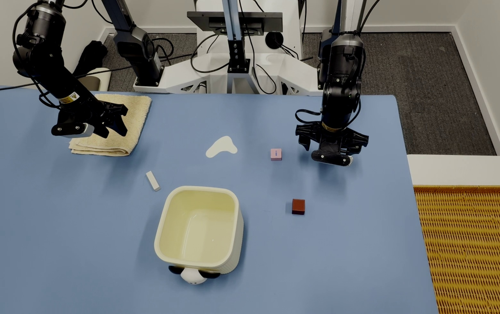

# 桌面清洁任务套件

> RTC Anything 的机器人桌面清洁任务指南。平台架构、运行时配置和部署命令请参考[主 README](../README_zh.md)。

---

## 📋 目录

- [效果演示](#-效果演示)
- [场景搭建](#-场景搭建)
- [数据采集](#-数据采集)
- [清洁策略](#-清洁策略)
- [常见问题排查](#-常见问题排查)

---

## 📺 效果演示

<table align="center">
  <tr>
    <td align="center" width="360">
      <video src="https://github.com/user-attachments/assets/93bdf721-f4e2-4eb4-a72a-77992a5f19e2" controls width="360"></video>
    </td>
  </tr>
</table>

---

## 🎬 场景搭建

场景搭建、相机布局、光照控制和工作台要求与[衣物折叠任务套件](clothes_folding_zh.md)保持一致，此处不再赘述。

### 📸 真实场景展示

以下是桌面清洁任务的真实工作空间俯视视角：

  

---

## 📊 数据采集

数据采集流程、ROS topic 配置、时间同步、相机参数调节、数据格式转换和采集规范与[衣物折叠任务套件](clothes_folding_zh.md)保持一致。

采集时需要保证物体抓取顺序、放入小桶位置、毛巾抓取方式和擦拭路径在不同 demonstration 中保持一致。

---

## 🧠 清洁策略

### 任务目标

机器人需要先由左臂按顺序夹起两个物体并放入小桶，再由右臂夹起第三个物体放入小桶，随后夹起毛巾擦拭掉桌面上的牛奶，最后结束任务。

### 标准操作流程

1. 左臂夹起第一个物体，并放入小桶。
2. 左臂夹起第二个物体，并放入小桶。
3. 右臂夹起第三个物体，并放入小桶。
4. 机械臂夹起毛巾。
5. 使用毛巾擦拭桌面上的牛奶区域。
6. 确认牛奶区域被擦除后，机械臂回到结束姿态，任务完成。

### 采集一致性要点

- **固定物体顺序**：三个物体的抓取顺序在所有 demonstration 中保持一致。
- **放置位置一致**：每个物体都应稳定放入小桶，释放高度和释放位置尽量统一。
- **毛巾抓取一致**：抓取毛巾的位置、夹爪闭合时机和抬升高度应保持稳定。
- **擦拭路径一致**：擦拭牛奶时使用固定方向、固定范围和固定终止条件。
- **结束状态一致**：擦拭完成后机械臂应回到统一结束姿态，便于模型学习任务边界。

---

## 🔍 常见问题排查

| 现象 | 可能原因 | 解决方案 |
|------|----------|----------|
| 物体未稳定落入小桶 | 释放高度过高，或小桶上方释放位置不一致 | 降低释放高度，统一小桶上方的释放位置 |
| 物体抓取失败 | 夹爪未稳定接近物体表面，或抓取高度不一致 | 采集时保持“先接近物体表面再闭合”的动作规范，并统一抓取高度 |
| 毛巾抓取后滑落 | 抓取位置偏离毛巾稳定夹持区域，或夹持力不足 | 调整抓取位置或夹持力，避免只夹到毛巾边缘 |
| 牛奶擦拭不干净 | 擦拭方向、覆盖范围或终止条件不一致 | 统一擦拭方向和覆盖范围，必要时增加一次重叠擦拭 |
| 训练 loss spike | 采集时开启了自动曝光，或动作顺序在不同轨迹中发生变化 | 关闭自动曝光，并确认每条轨迹的动作顺序一致 |
